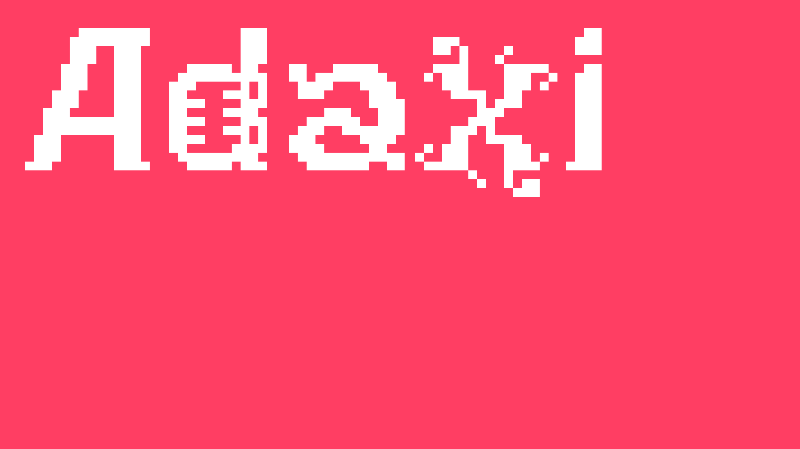
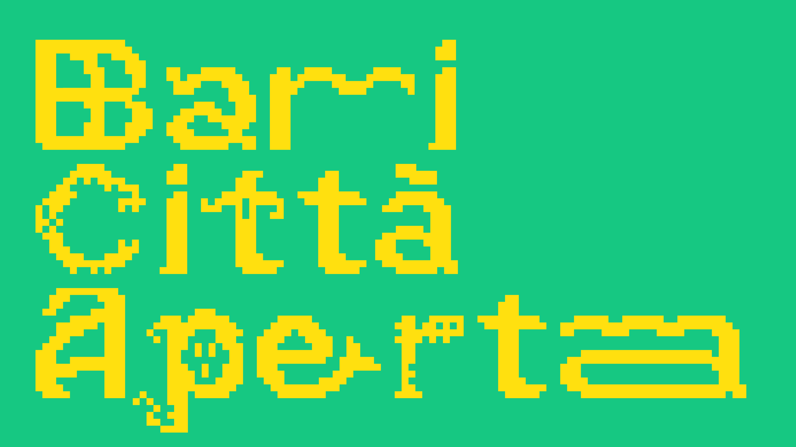
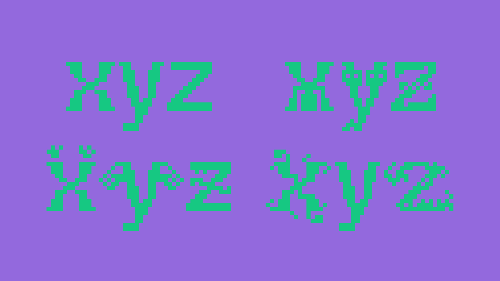
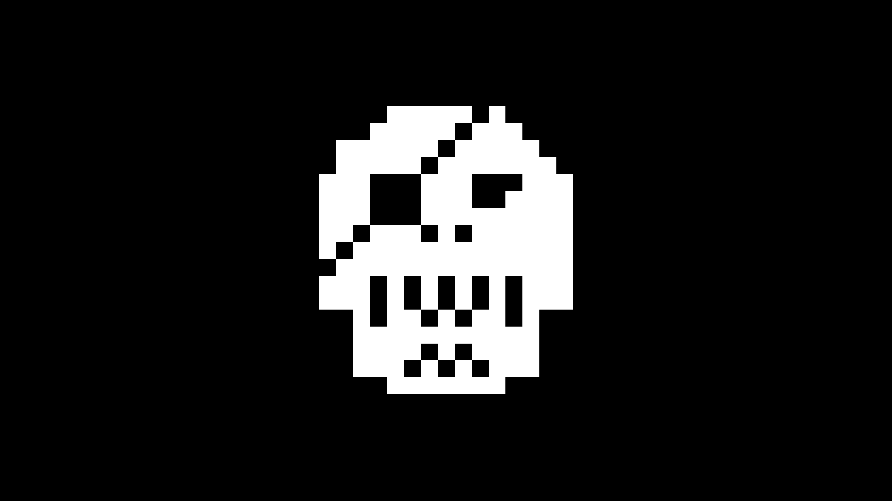
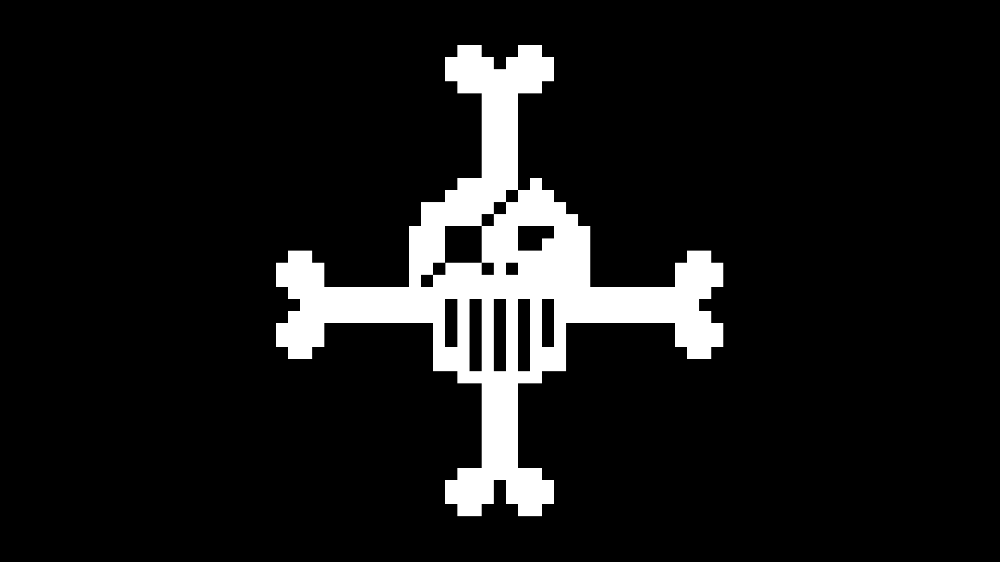

# 🔤 Adaxi

Adaxi was collectively designed by a team of designers and non-designers during ["Bari Città Aperta"](https://baricittaperta.xyz) XYZ workshop by [La Scuola Open Source](https://lascuolaopensource.xyz), 8–17 July 2025, and released under the SIL Open Font License 1.1 in 2025.

Adaxi is a display typeface available in a single style, enriched with multiple stylistic set alternatives. Designed for experimental use, it will remain a work in progress, with new glyphs added over time. It performs best at large sizes and when mixing different stylistic sets.

Basic letterforms were designed using [GTL](https://github.com/bbtgnn/GTL-web) (https://github.com/bbtgnn/GTL), with grid based system and squared pixels. Stylistic sets were developed by modifying, moving points and stretching the original sources.

## 🖼️ Specimen

## 👀 Beta Font – Handle with Care

This typeface is a work in progress!  
Some letters might still look a bit odd, and the spacing or kerning might not be perfect. Feel free to try it, break it, and share your feedback.

## 📜 License

Adaxi is licensed under the SIL Open Font License, Version 1.1.
Available with a FAQ at http://scripts.sil.org/OFL

## 📂 Repository Layout

This font repository follows the Unified Font Repository v2.0,
a standard way to organize font project source files. Learn more at
https://github.com/unified-font-repository/Unified-Font-Repository
